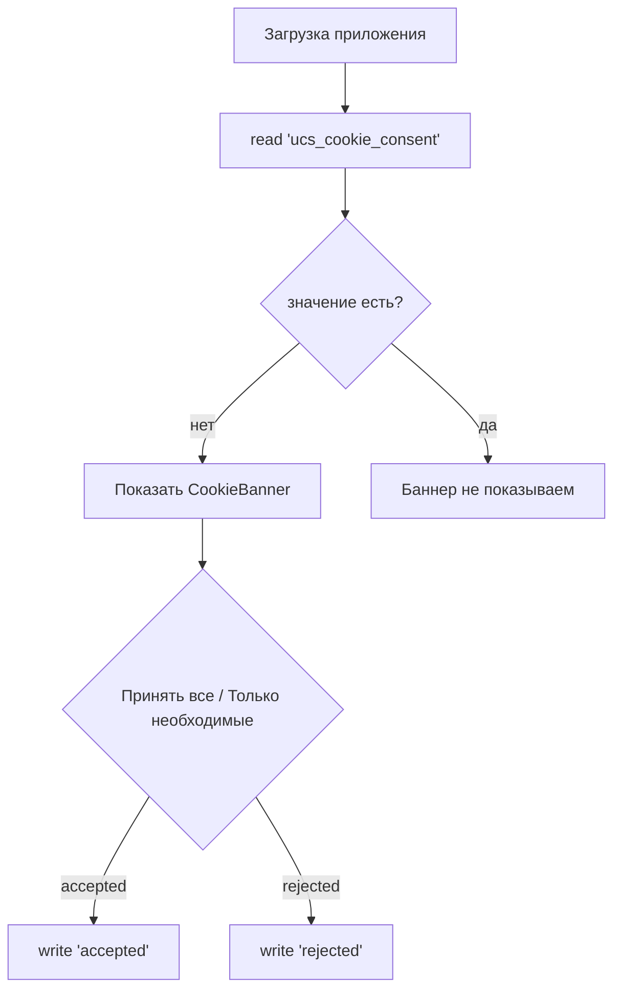

# Система localStorage — дизайн и потоки данных

**Дата:** 03.08.2026
**Статус:** дизайн-документ (актуализирован после перевода контура в полностью публичный)
**Область:** frontend (`apps/frontend`), информационно-обучающий портал без ЛК.

---

## 1. Цель и границы

### 1.1. Что осталось в localStorage

После удаления авторизации, ЛК, персонализации школы и геймификации (2026-08) на клиенте хранится **единственный ключ**:

| Ключ | Модуль-писатель | Данные | Формат |
|------|-----------------|--------|--------|
| `ucs_cookie_consent` | `components/layout/CookieBanner.tsx` | Выбор согласия (152-ФЗ) | `'accepted' \| 'rejected'` |

Прогресс школы **не хранится**: курсы и уроки открыты, прохождение завершается финальным экраном без записи результата (см. `docs/touchpoints.md`).

### 1.2. Что удалено из localStorage

| Удалённый ключ | Бывший модуль | Причина удаления |
|----------------|---------------|------------------|
| `ucs-auth` | `stores/auth.ts` (Zustand persist) | Авторизация удалена |
| `school_profile`, `school_stats`, `school_course_progress`, `school_badges_earned`, `school_certificates_earned` | `lib/school/storage.ts` | Персонализация и геймификация школы удалены |
| `games_arena_progress`, `games_train_progress` | `lib/games/storage.ts` | Мини-игры удалены |
| `tips_records` | `lib/tips/storage.ts` | Чаевые (ЛК) удалены |
| `quality_surveys` | `lib/feedback/storage.ts` | Опрос качества (ЛК) удалён |

---

## 2. Потоки данных

### 2.1. Cookie-consent (ключ `ucs_cookie_consent`)

Особенности:
- Пишется один раз; повторный показ баннера не предусмотрен.
- Удаление не предусмотрено — согласие хранится до конца жизни данных пользователя на устройстве.
- Чтение только на клиенте (SSR-safe): на сервере возвращаем дефолт.

---

## 3. Quota и обработка ошибок

- Бюджет localStorage ~5MB на домен. Фактический объём — единицы байт (один ключ).
- Запись обёрнута в `try/catch`: при `QuotaExceededError` — не падаем, возвращаем дефолт.
- Чтение повреждённого JSON → дефолт (через `catch {}`).

---

## 4. Известные ограничения и дальнейшие шаги

1. **Гонки между вкладками**: RMW (read-modify-write) не атомарен, но для одного ключа-согласия риск минимален.
2. Если в будущем вернётся ЛК/прогресс (ветка `main-arhive`), клиентское хранилище данных пользователя целесообразно выносить на backend (Prisma), а не в localStorage.
