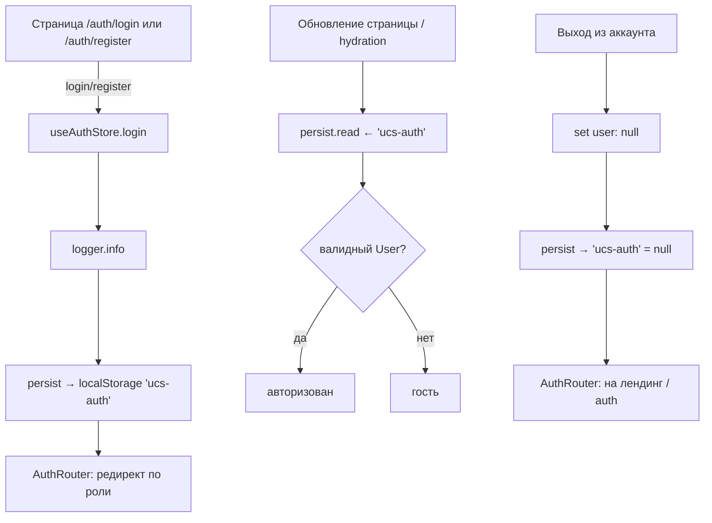
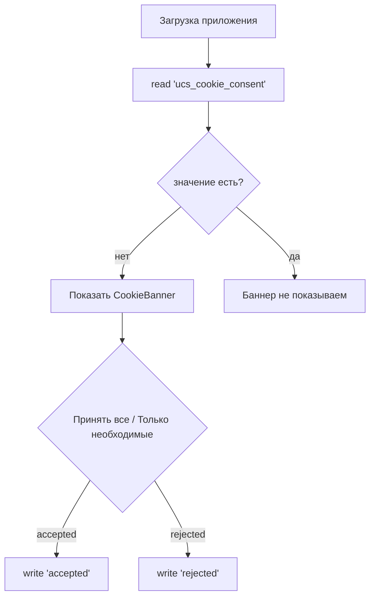
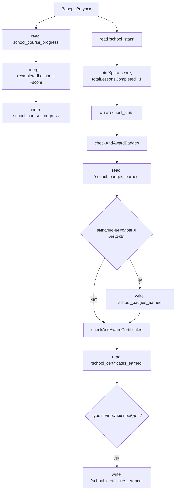
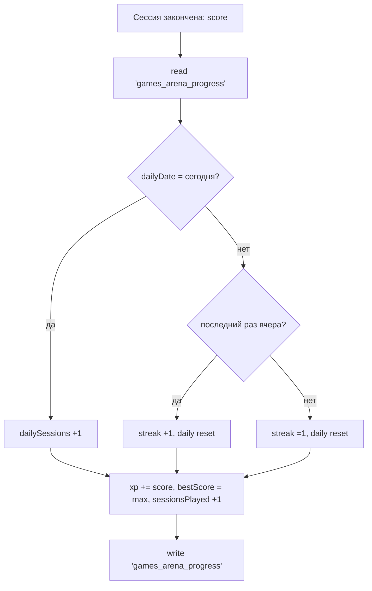
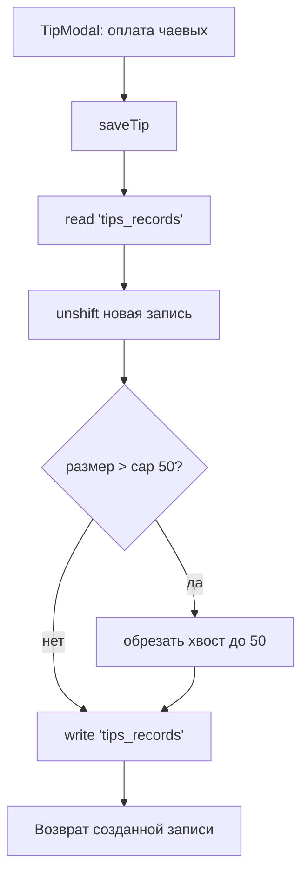
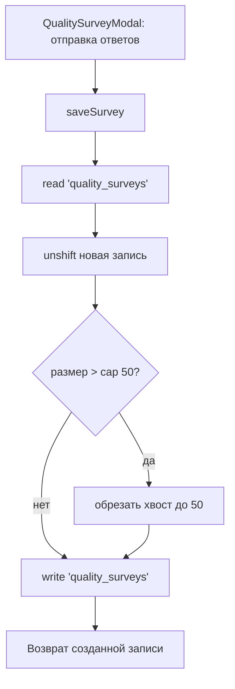
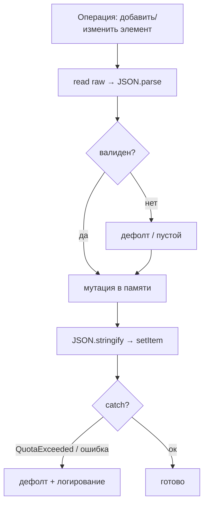
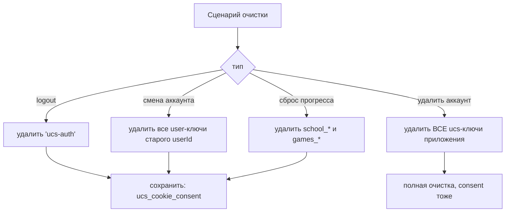

# Система localStorage — дизайн и потоки данных

**Дата:** 03.08.2026
**Статус:** дизайн-документ (на согласование)
**Область:** frontend (`apps/frontend`), mock-фаза до подключения backend для пользовательских данных.

---

## 1. Цель и границы

### 1.1. Зачем нужен localStorage

На текущей фазе проекта (MVP Core, backend покрывает только заявки/админку/feedback) данные пользовательского контура — прогресс Школы, игры, чаевые, опросы, согласие cookie и mock-сессия физлица — хранятся на клиенте. localStorage используется как:

- **демо/оффлайн-хранилище** — переживает перезагрузку страницы в отличие от in-memory;
- **хранилище прогресса геймификации** — XP, уровни, бейджи, сертификаты;
- **хранилище согласий** — cookie-баннер (152-ФЗ);
- **mock-сессия физлица** — Zustand `persist`.

### 1.2. Что НЕ входит в эту систему

| Сущность | Где живёт | Почему не в localStorage |
|----------|-----------|--------------------------|
| Созданные записи (bookings), админ CRUD услуг/специалистов/слотов, пользователи mockDB | **in-memory** (`src/lib/mock-db.ts`) | Сбрасывается при перезагрузке — это осознанно: данные готовятся к backend (Prisma). См. §7 |
| Сессия администратора | **cookie** `ucs-auth` (backend, httpOnly JWT) | Секрет, недоступен JS. В localStorage не попадает |
| Пароли, токены, ключи | никогда | Запрещено политикой §2.4 |

### 1.3. Терминология

- **ключ (key)** — имя записи в localStorage;
- **read-modify-write (RMW)** — паттерн «прочитать целиком → изменить в памяти → записать целиком»;
- **конверт (envelope)** — целевой формат записи `{ v, data }` с версией схемы (§8).

---

## 2. Принципы (политика)

Политика фиксирует целевое состояние. Часть пунктов реализована сегодня, часть — задачи на рефакторинг (см. матрицу §9).

### N1. Единый слой доступа

Все чтения и записи — через единый модуль `lib/storage/*` (обёртка над `localStorage`): безопасный `get`/`set`/`remove` с `try/catch`, дефолтами, версионированием и учётом квоты. Сегодня доступ размазан по 6 файлам (`stores/auth.ts`, `CookieBanner.tsx`, `lib/school/storage.ts`, `lib/games/storage.ts`, `lib/tips/storage.ts`, `lib/feedback/storage.ts`) и местами дублируется (`games_arena_progress` пишется из двух модулей). Цель — один источник правды по правилам хранения.

### N2. Неймспейс ключей

Все ключи приложения — с префиксом `ucs_`. Сейчас часть ключей без префикса (`school_*`, `games_*`, `tips_records`, `quality_surveys`) — их нужно переименовать с миграцией (§3, §9).

### N3. Версионирование схемы

Записи хранятся в конверте `{ v: number, data: T }`. При изменении формата — bump версии конкретного ключа и `migrate()` на чтении. Сегодня версионирования нет: изменение структуры тихо сломает `JSON.parse` (теряется прогресс пользователя).

### N4. Безопасность и ПДн (152-ФЗ)

- В localStorage **никогда** не пишем: пароли, JWT, токены, секреты.
- ПДн (`ucs-auth`, `school_profile`) — минимизируем и **привязываем к `userId`**; при logout/смене аккаунта — очищаем персональные ключи (§5.3).
- Ключи геймификации (`school_stats` и т.п.) по логике принадлежат пользователю — после появления реальных пользователей должны скапироваться на `userId` или выехать на backend.

### N5. Квоты и контроль роста

- Бюджет localStorage ~5MB на домен. Текущий объём — единицы КБ (§6.1), риск переполнения низкий, но растущие списки получают cap (§6.2).
- Все операции обёрнуты в `try/catch`; при `QuotaExceededError` — не падаем, возвращаем дефолт и логируем (сегодня ошибки глотаются молча — исправить).

### N6. SSR-safe

Чтение localStorage только на клиенте: guard `typeof window === 'undefined'` + `try/catch`. На сервере возвращаем дефолты. Этот паттерн уже соблюдён во всех модулях — сохраняем.

---

## 3. Инвентаризация текущего состояния

### 3.1. Реестр ключей

| № | Ключ | Модуль-писатель | Данные | Формат | Рост | Перезапись | Удаление |
|---|------|-----------------|--------|--------|------|------------|----------|
| 1 | `ucs-auth` | `stores/auth.ts` (Zustand persist) | Пользователь + флаг | `{ user, isAuthenticated }` | фикс. | целиком (login/register/setUser/logout) | logout → `null` |
| 2 | `ucs_cookie_consent` | `components/layout/CookieBanner.tsx` | Выбор согласия | `'accepted' \| 'rejected'` | фикс. | повторный клик | нет |
| 3 | `school_profile` | `lib/school/storage.ts` | Профиль школы | `SchoolProfile` | фикс. | целиком (saveProfile) | нет |
| 4 | `school_stats` | `lib/school/storage.ts` | Сводка прогресса | `SchoolStats` | фикс. | целиком (saveSchoolStats) | нет |
| 5 | `school_course_progress` | `lib/school/storage.ts` | Прогресс по курсам | `Record<courseId, CourseProgress>` | растёт | RMW всей мапы | нет |
| 6 | `school_badges_earned` | `lib/school/storage.ts` | ID бейджей | `string[]` | мал. | RMW (добавление) | нет |
| 7 | `school_certificates_earned` | `lib/school/storage.ts` | ID сертификатов | `string[]` | мал. | RMW (добавление) | нет |
| 8 | `games_arena_progress` | `lib/games/storage.ts` + `lib/school/storage.ts` | Прогресс «Arena» | `ArenaProgress` | фикс. | целиком (recordSessionEnd) | нет |
| 9 | `games_train_progress` | `lib/games/storage.ts` + `lib/school/storage.ts` | Прогресс «Train» | `TrainProgress` | фикс. | целиком | нет |
| 10 | `tips_records` | `lib/tips/storage.ts` | История чаевых | `TipRecord[]` | растёт | unshift в начало | нет |
| 11 | `quality_surveys` | `lib/feedback/storage.ts` | Ответы опроса качества | `QualitySurveyRecord[]` | растёт | unshift в начало | нет |

### 3.2. Типы данных

```ts
SchoolProfile: { name, role, email, phone, company }
SchoolStats:   { totalXp, totalLessonsCompleted, totalCoursesCompleted,
                 currentStreak, badgesEarned[], certificatesEarned[],
                 rankPosition, level }
CourseProgress:{ courseId, completedLessons[], totalScore, startedAt, completedAt }
ArenaProgress: { xp, bestScore, sessionsPlayed, dailyDate, dailySessions, streak }
TrainProgress: { casesSolved, level, sessionsCompleted }
TipRecord:     { id, bookingId, specialistName, amount, date }
QualitySurveyRecord: { id, bookingId, specialistName, answers: Record<string, number>, comment, date }
```

### 3.3. Матрица «фича → модуль → ключ»

| Фича | Компонент/страница | Модуль хранения | Ключ |
|------|--------------------|-----------------|------|
| Вход/регистрация/выход физлица | `app/auth/*`, `AuthModal` | `stores/auth.ts` | `ucs-auth` |
| Cookie-баннер | `CookieBanner` | `CookieBanner.tsx` | `ucs_cookie_consent` |
| Профиль школы | `app/school/profile/*` | `lib/school/storage.ts` | `school_profile` |
| Дашборд школы, статистика | `app/school/page.tsx` | `lib/school/storage.ts` | `school_stats` |
| Прохождение курсов/уроков | `app/school/courses/*` | `lib/school/storage.ts` | `school_course_progress` |
| Бейджи, сертификаты | `app/school/badges|certificates/*` | `lib/school/storage.ts` | `school_badges_earned`, `school_certificates_earned` |
| Мини-игры | `games/tracker/bubble/**` | `lib/games/storage.ts` (дубль в `lib/school/storage.ts`) | `games_arena_progress`, `games_train_progress` |
| Чаевые | `components/features/TipModal.tsx` | `lib/tips/storage.ts` | `tips_records` |
| Опрос качества | `components/features/QualitySurveyModal.tsx` | `lib/feedback/storage.ts` | `quality_surveys` |

---

## 4. Потоки данных

Схемы ниже описывают реальные сценарии чтения/записи. Сокращения: **R** — read, **W** — write.

### 4.1. Auth (ключ `ucs-auth`)



Особенности:
- Единственный писатель — `useAuthStore` (L5 по `docs/auth-redirects.md`).
- `isAuthenticated` и `user` хранятся в одной записи; при выходе запись перезаписывается на `null`-пользователя, а не удаляется.

### 4.2. Cookie-consent (ключ `ucs_cookie_consent`)



Особенности:
- Пишется один раз, перезапись возможна только повторным решением (сейчас кнопки повторного показа нет).
- Удаление не предусмотрено — согласие хранится до конца жизни данных пользователя на устройстве.

### 4.3. Школа (курсы, бейджи, сертификаты)



Особенности:
- Каскад: урок → `course_progress` → `stats` → проверка бейджей → проверка сертификатов. Каждый шаг — отдельный RMW.
- `school_stats` хранит денормализованные копии `badgesEarned[]`/`certificatesEarned[]` при том, что источники истины — отдельные ключи. Источник истины нужно зафиксировать (рекомендация: `school_stats` — читает из списков, не хранит копии).

### 4.4. Игры (Arena/Train)



Особенности:
- Внутреннее «TTL» по дате: `dailyDate`/`dailySessions`/`streak` — временные, пересчитываются на каждый день.
- Код продублирован в `lib/games/storage.ts` и `lib/school/storage.ts` — дублирование устранить при рефакторинге (§9).

### 4.5. Чаевые (ключ `tips_records`)



### 4.6. Опрос качества (ключ `quality_surveys`)



### 4.7. Общий паттерн RMW (риски)



Риск: **гонки между вкладками**. RMW не атомарен: две вкладки читают одну запись, каждая пишет свою версию — последняя побеждает, данные теряются. Для mock-фазы приемлемо (один пользователь, обычно одна вкладка), но фиксируем как известное ограничение; при переносе на backend гонки снимает транзакция на сервере.

---

## 5. Обновление, перезапись, удаление

### 5.1. Стратегия записи по ключам

| Стратегия | Ключи | Описание |
|-----------|-------|----------|
| **Полная перезапись** | `ucs-auth`, `ucs_cookie_consent`, `school_profile`, `school_stats`, `games_*` | Пишется целиком новый объект (нет слияния со старым) |
| **RMW (merge)** | `school_course_progress`, `school_badges_earned`, `school_certificates_earned`, `tips_records`, `quality_surveys` | Читается существующее, модифицируется, пишется целиком |

### 5.2. Условия перезаписи

- `school_stats` и `games_*` перезаписываются на **каждое** событие прогресса (урок, сессия игры) — частая запись маленьких объектов, приемлемо.
- Растущие списки (5, 10, 11) перезаписываются целиком на каждый `add` — при cap 50 это сотни байт на запись, допустимо.

### 5.3. Удаление и очистка

| Сценарий | Что удаляется/очищается | Где |
|----------|--------------------------|-----|
| **Выход из аккаунта** | `ucs-auth` → `null` (персональные данные) | `useAuthStore.logout()` |
| **Смена аккаунта на устройстве** | персональные и user-скопные ключи предыдущего пользователя | целевое состояние — `clearUserScope(userId)` |
| **«Удалить аккаунт»** (`/notifications`, Управление данными) | полная очистка всех user-ключей (auth, школа, игры, чаевые, опросы) | целевое состояние |
| **Сброс прогресса школы** | `school_*`, `games_*` | целевое состояние (сейчас кнопки нет) |
| **Cookie-consent** | не удаляется (согласие хранится) | — |

Целевая функция очистки:



### 5.4. TTL и временные данные

| Ключ/поле | Срок жизни | Механизм |
|-----------|-----------|----------|
| `dailyDate`, `dailySessions`, `streak` (`games_*`) | 1 день | сравнение дат при чтении (`getRemainingSessions`, `recordSessionEnd`) |
| `ucs_cookie_consent` | вечно (до удаления данных) | отсутствие механизма повторного показа |
| Прогресс школы, чаевые, опросы | вечно (до backend/очистки) | — |

---

## 6. Квоты и лимиты

### 6.1. Бюджет

Лимит localStorage на домен — **~5MB** (обычно 5–10MB в зависимости от браузера). Текущий объём приложения — **единицы КБ** (десятки записей по ~100–300 байт). Риск переполнения низкий, но растущие ключи должны быть ограничены.

### 6.2. Cap растущих списков

| Ключ | Лимит | Политика |
|------|-------|----------|
| `tips_records` | 50 записей | при добавлении — обрезать хвост (старые) |
| `quality_surveys` | 50 записей | при добавлении — обрезать хвост |
| `school_course_progress` | по числу курсов каталога | не хранить прогресс удалённых/не начатых курсов |
| `school_badges_earned`, `school_certificates_earned` | по каталогу | set-логика, дубли исключены |

### 6.3. Поведение при переполнении (`QuotaExceededError`)

1. `setItem` обёрнут в `try/catch` (уже есть во всех модулях).
2. Целевое: при `QuotaExceededError` — **не глотать молча**, а: применить cap/evict старых записей → при неудаче вернуть дефолт и залогировать (`logger.warn`).
3. Чтение повреждённого JSON → дефолт (уже есть через `catch {}`).

---

## 7. mockDB (in-memory) — границы

Данные, живущие в памяти модуля `src/lib/mock-db.ts` и сбрасываемые при перезагрузке:

- созданные записи (booking), отмена/перенос/отзыв;
- админ CRUD услуг и специалистов;
- переключение доступности слотов;
- пользователи и пароли seed (`root@ucs.ru` и т.п.).

**Решение:** эти данные **не переносим в localStorage**. Причины:

- это серверные сущности (записи, каталог, расписание) — их место в backend (Prisma), а не в хранилище браузера;
- админ-данные в localStorage противоречат политике безопасности и смешивают роли;
- при подключении backend-эндпоинтов (`POST /bookings`, `GET /services` и т.д.) mockDB удаляется целиком, а не мигрируется.

mockDB живёт ровно до момента подключения соответствующего API. В дизайн localStorage не входит.

---

## 8. Целевая схема (конверт с версией)

Целевой формат для всех ключей — единый конверт:

```ts
interface Stored<T> {
  /** Версия схемы ключа. Инкремент при изменении формата. */
  v: number;
  /** Полезные данные. */
  data: T;
}

// Пример: ключ 'ucs_school_stats'
localStorage.setItem('ucs_school_stats', JSON.stringify({
  v: 1,
  data: { totalXp: 420, totalLessonsCompleted: 7, ... },
}));
```

Правила:

1. Все ключи — с префиксом `ucs_` (N2).
2. Каждый ключ имеет `STORE_SCHEMA_VERSION`.
3. Чтение через `migrate()`: если `v` ниже актуальной — применяем миграцию и перезаписываем.
4. Неизвестные поля не ломают чтение (деструктуризация с дефолтами — текущий паттерн `{ ...defaults, ...parsed }` сохраняем).
5. Модуль `lib/storage/*` предоставляет `get<T>(key)`, `set<T>(key, data)`, `remove(key)`, `clearUserScope(userId)`, `clearAll()` — единая точка доступа (N1).

Пример типов единого слоя (без реализации в этой фазе):

```ts
// lib/storage/keys.ts
export const KEYS = {
  auth:            { key: 'ucs_auth',             v: 1 },
  cookieConsent:   { key: 'ucs_cookie_consent',   v: 1 },
  schoolProfile:   { key: 'ucs_school_profile',   v: 1 },
  schoolStats:     { key: 'ucs_school_stats',     v: 1 },
  courseProgress:  { key: 'ucs_course_progress',  v: 1 },
  badgesEarned:    { key: 'ucs_badges_earned',    v: 1 },
  certsEarned:     { key: 'ucs_certs_earned',     v: 1 },
  arenaProgress:   { key: 'ucs_games_arena',      v: 1 },
  trainProgress:   { key: 'ucs_games_train',      v: 1 },
  tips:            { key: 'ucs_tips',             v: 1 },
  surveys:         { key: 'ucs_quality_surveys',  v: 1 },
} as const;
```

---

## 9. Матрица «сейчас → целевое»

Рекомендованные изменения (выполняются отдельным рефакторингом после согласования дизайна):

| # | Сейчас | Целевое | Тип |
|---|--------|---------|-----|
| 1 | Доступ размазан по 6 модулям, дублируется (`games_*`) | Единый `lib/storage/*`, один источник правил | рефакторинг |
| 2 | Ключи без префикса (`school_*`, `games_*`, `tips_*`, `quality_*`) | Все с префиксом `ucs_` + миграция старых ключей | миграция |
| 3 | Нет версионирования | Конверт `{ v, data }` + `migrate()` | миграция |
| 4 | `school_stats` дублирует `badgesEarned[]`/`certificatesEarned[]` | Источник истины — отдельные ключи | рефакторинг |
| 5 | `try/catch {}` молча глотает ошибки записи | Логирование + evict/cap при квоте | улучшение |
| 6 | Растущие списки без cap | `tips_records`/`quality_surveys` cap 50 | улучшение |
| 7 | logout очищает только `ucs-auth` | `clearUserScope(userId)` при смене аккаунта; «Удалить аккаунт» → полная очистка | улучшение |
| 8 | Нет сброса прогресса школы | Кнопка «Сбросить прогресс» (clear `school_*`, `games_*`) | фича |
| 9 | ПДн не скапируются по пользователю | Скоп `userId` после появления реальных аккаунтов | roadmap |
| 10 | mockDB в памяти | Не переносится; удаляется при подключении backend | решение |

---

## 10. Открытые вопросы

1. **User-scoping**: привязывать ключи геймификации к `userId` сейчас или после подключения реальной авторизации?
2. **Cookie-consent**: нужен ли повторный показ баннера / возможность изменить выбор?
3. **Сброс прогресса**: разместить в `/settings` → «Внешний вид»/«Безопасность» или в школе?
4. **Количество сессий игр в день**: лимит `maxPerDay` — конфигурируется где? (сейчас из `data/games-config.json`).
5. **Файлы (аватары, вложения чата)**: в localStorage не кладём; решение — object storage/backend, зафиксировать отдельно.
6. После подключения backend: какие из localStorage-ключей мигрируют на сервер, а какие остаются локальными (cookie-consent, кэш)?
