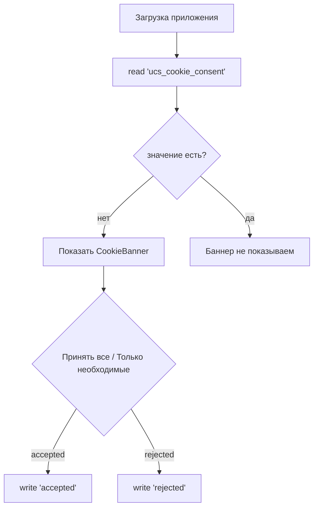
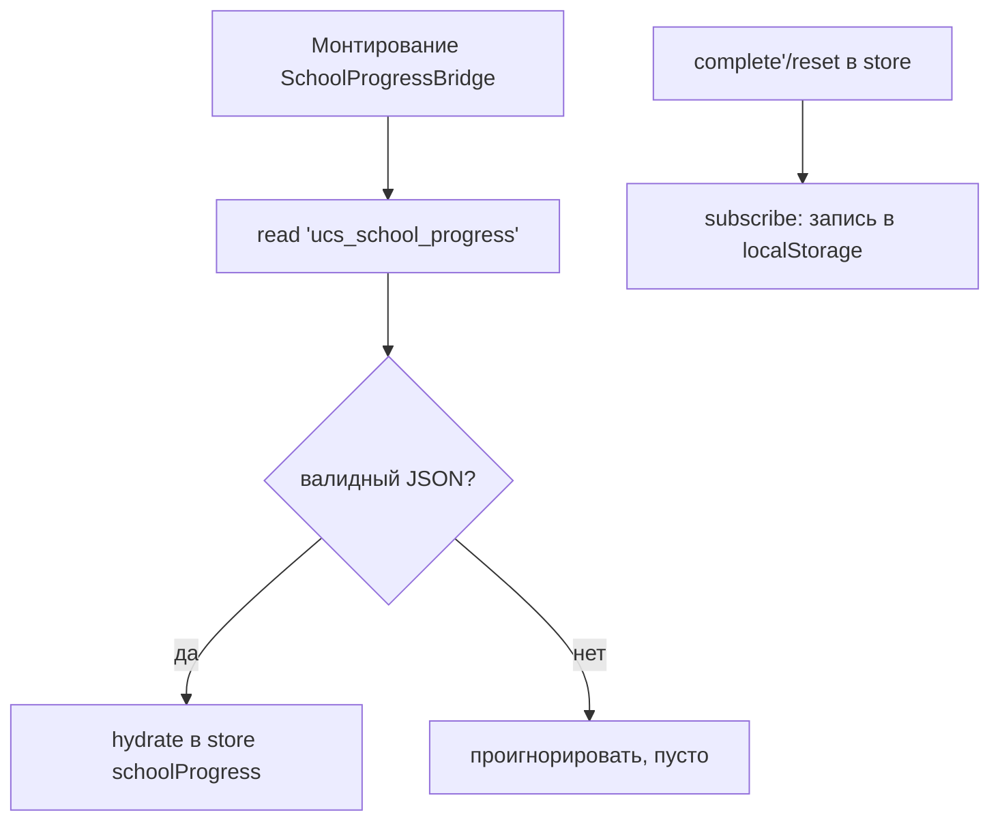
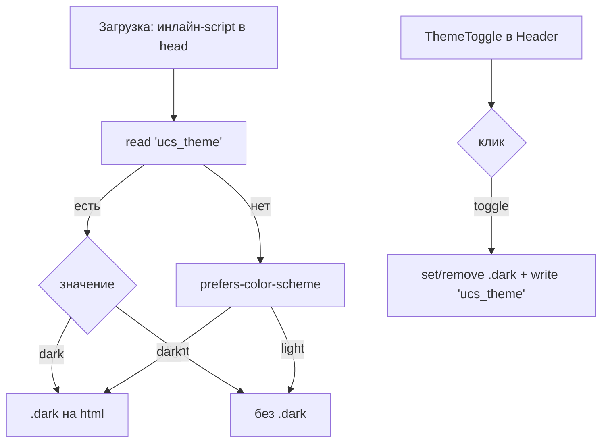

# Система localStorage — дизайн и потоки данных

**Дата:** 03.08.2026
**Статус:** дизайн-документ (актуализирован после перевода контура в полностью публичный)
**Область:** frontend (`apps/frontend`), информационно-обучающий портал без ЛК.

---

## 1. Цель и границы

### 1.1. Что хранится в localStorage

| Ключ | Модуль-писатель | Данные | Формат |
|------|-----------------|--------|--------|
| `ucs_cookie_consent` | `components/layout/CookieBanner.tsx` | Выбор согласия (152-ФЗ) | `'accepted' \| 'rejected'` |
| `ucs_school_progress` | `components/school/SchoolProgressBridge.tsx` → `stores/schoolProgress.ts` | Пройденные уроки школы | JSON `Record<lessonId, true>` |
| `ucs_theme` | `components/layout/ThemeToggle.tsx` | Тёмная/светлая тема | `'light' \| 'dark'` |

Прогресс школы хранится **локально** (`ucs_school_progress`), без backend и без ЛК: `completed` — словарь пройденных уроков по `lesson.id` из `data/school/courses.json`. Читается и пишется через `stores/schoolProgress.ts` (Zustand) и bridge-компонент `SchoolProgressBridge` (монтируется в корневом layout).

### 1.2. Что удалено из localStorage

| Удалённый ключ | Бывший модуль | Причина удаления |
|----------------|---------------|------------------|
| `ucs-auth` | `stores/auth.ts` (Zustand persist) | Авторизация удалена |
| `school_profile`, `school_stats`, `school_course_progress`, `school_badges_earned`, `school_certificates_earned` | `lib/school/storage.ts` | Персонализация и геймификация школы удалены |
| `games_arena_progress`, `games_train_progress` | `lib/games/storage.ts` | Мини-игры удалены |
| `tips_records` | `lib/tips/storage.ts` | Чаевые (ЛК) удалены |
| `quality_surveys` | `lib/feedback/storage.ts` | Опрос качества (ЛК) удалён |

---

## 2. Потоки данных

### 2.1. Cookie-consent (ключ `ucs_cookie_consent`)

Особенности:
- Пишется один раз; повторный показ баннера не предусмотрен.
- Удаление не предусмотрено — согласие хранится до конца жизни данных пользователя на устройстве.
- Чтение только на клиенте (SSR-safe): на сервере возвращаем дефолт.

---

## 2. Потоки данных

### 2.2. Прогресс школы (ключ `ucs_school_progress`)

Особенности:
- Хранилище `stores/schoolProgress.ts` — чистый Zustand без `persist` (чтобы не было sync-гидрации до первого рендера и hydration mismatch).
- Bridge `SchoolProgressBridge` (client-only, рендерит `null`) читает ключ после монтирования и подписывается на изменения store для записи.
- UI прогресса (`CourseProgressPanel`, отметки в `ModuleBlock`, «урок уже пройден») рендерится через `useHydrated` gate: SSR и первый клиентский рендер показывают placeholder, реальные данные — после гидрации (без mismatch по тексту).
- SSR-safe: на сервере `completed = {}`, все прогресс-элементы скрыты.
- Сброс прогресса по курсу — кнопка «Сбросить прогресс» в `CourseProgressPanel` (очищает id уроков курса).

---

## 2. Потоки данных

### 2.3. Тема (ключ `ucs_theme`)

Особенности:
- Тумблер `ThemeToggle` в Header (клиентский, `ssr:false`) переключает класс `.dark` на `<html>` и пишет `ucs_theme`.
- Инлайн-скрипт в `head` (layout, `next/script` `beforeInteractive`) ставит тему до гидрации — без FOUC.
- CSS тёмной темы — в `globals.css` блок `.dark …`: переопределяются поверхности (glass-*), тексты/фоны/границы по hex-утилитам (CSS-селекторы). Тумблер монтируется только на клиенте, поэтому SSR не затрагивается.
- Default — системная схема (`prefers-color-scheme`) при отсутствии сохранённого значения.

---

## 3. Quota и обработка ошибок

- Бюджет localStorage ~5MB на домен. Фактический объём — десятки байт (три ключа: согласие, прогресс школы, тема).
- Запись обёрнута в `try/catch`: при `QuotaExceededError` — не падаем, возвращаем дефолт.
- Чтение повреждённого JSON → дефолт (через `catch {}`).

---

## 4. Известные ограничения и дальнейшие шаги

1. **Гонки между вкладками**: RMW (read-modify-write) не атомарен. Для согласия риск минимален; для прогресса школы две вкладки могут затереть словарь пройденных уроков друг друга (приемлемо, т.к. данные некритичны).
2. Если в будущем вернётся ЛК/прогресс (ветка `main-arhive`), клиентское хранилище данных пользователя целесообразно выносить на backend (Prisma), а не в localStorage.
